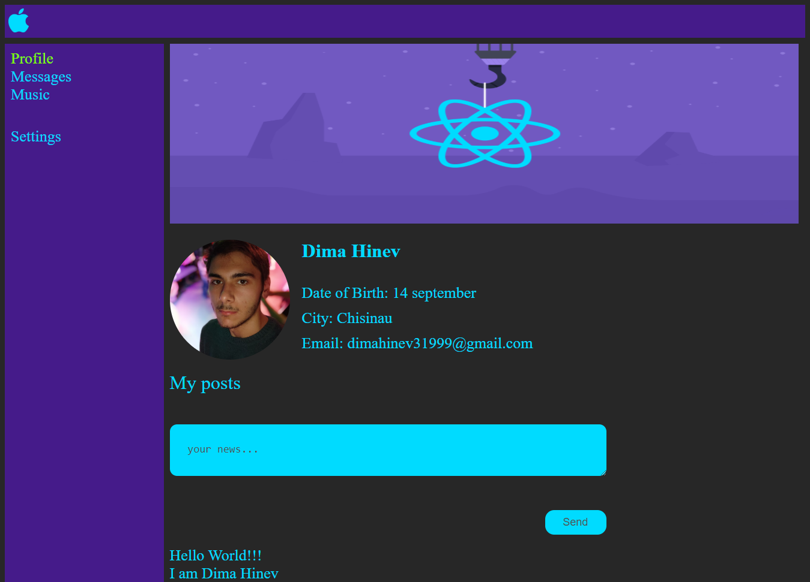
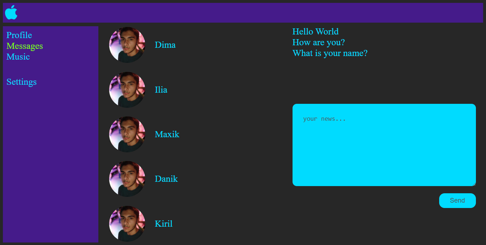

# [Click to try on github pages](https://daimon31999.github.io/react.js-social-network/)

[

# Installation
* `npm install -g npm-install-missing`
* `npm-install-missing`
* `npm start`

# Screenshots
## Profile page

## Messages page

